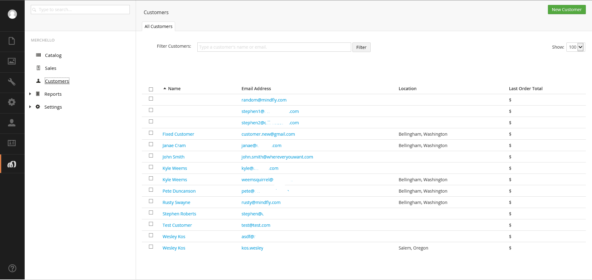

##Introduction##
The Customers page is where you manage your customers in the store.   You can filter your view of the customers to see only the customers you want.  You can also add, edit or delete customers right from the customers page.

  